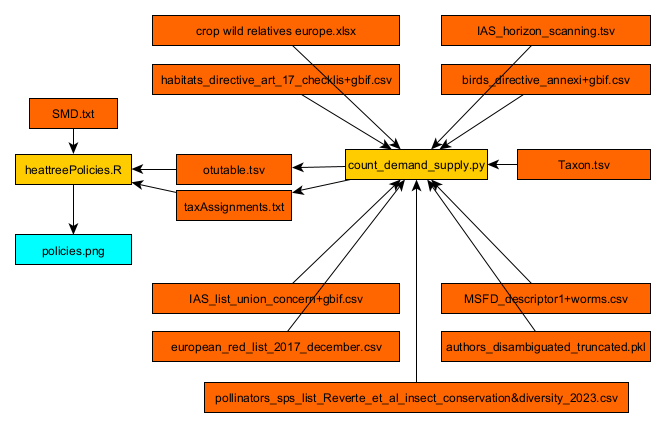

# TETTRIs WP3, task 3.2: automatic mapping of taxonomic expertise
This repository contains the scripts used to find European authors of taxonomic articles, identify the species they study, and compare their taxa of expertise to some demands for taxonomic expertise.

## Prerequisites
Before starting you need to download the GBIF taxonomic backbone, unzip it and put the contents in the folder data/external/backbone

You may also need to install SPARQLWrapper, geopandas and fiona to your Python installation, i.e. using `pip install SPARQLWrapper`

## Configuration
The dates between which the workflow will extract publications is set within the config.json file.
The one and two word "keywords" are also set within the config file.
The OpenAlex concept values are set within config.json
The two letter country codes (ISO 3166-1 alpha-2) on which to conduct the analyis are listed in file included_countries.txt within the ./src/supply/ directory

To reuse or repurpose this script these configutations may need changing. However, if the script is to be repurposed for a subject other than biological taxonomy then list_journals.py would need rewriting or replacing, because it is focused on taxonomic journals.

#######################################################################################

## Demand for taxonomists

### Crop Wild Relatives

The crop wild relatives data where downloaded from the following dataset and placed in `data/external/crop wild relatives europe.xlsx`. These are public domain data, but are included here as a test dataset. We recommend anyone useing these scripts updates this file from source.

> USDA, Agricultural Research Service, National Plant Germplasm System. 2024. Germplasm Resources Information Network (GRIN Taxonomy). National Germplasm Resources Laboratory, Beltsville, Maryland. URL: https://npgsweb.ars-grin.gov/gringlobal/taxon/taxonomysearchcwr. Accessed 15 October 2024.

### IUCN Red List of Threatened Species

The "Research needed: taxonomy" data were downloaded from the IUCN Red List website as the file assessments.csv. These data are made available under the IUCN Red List Terms and Conditions for non-commercial use only, and redistribution is not permitted. Therefore, we cannot provide the input data directly here.

However, the data are used in their original format, as provided in the CSV file, with the following headers:
`assessmentId,internalTaxonId,scientificName,redlistCategory,redlistCriteria,yearPublished,assessmentDate,criteriaVersion,language,rationale,habitat,threats,population,populationTrend,range,useTrade,systems,conservationActions,realm,yearLastSeen,possiblyExtinct,possiblyExtinctInTheWild,scopes`

> IUCN. 2024. The IUCN Red List of Threatened Species. Version 2024-1. https://www.iucnredlist.org/. Accessed on [17 October 2024].

### Invasive alien species on the horizon in the European Union
Invasive species on the horizon were extracted from the supporting information table 7, titled "Preliminary species list 2: 120 species listed" . Accessed on [20 October 2024].

Roy HE, Bacher S, Essl F, et al. Developing a list of invasive alien species likely to threaten biodiversity and ecosystems in the European Union. *Glob Change Biol.* 2019; 25: 1032–1048. https://doi.org/10.1111/gcb.14527

### The Birds Directive
The file `birds_directive_annexi+gbif.csv` was used from https://github.com/linamaes/sps_taxonomy_plots_Task1d5 that were prepared for the report
Estupinan-Suarez, L. M., Groom, Q., Pereira, H., Preda, C., Rodrigues, A., Sica, Y., Teixeira, H., Yovcheva, N. & Fernandez, M. Alignment of B3 with European Biodiversity Initiative: Insights from EU policy.

### The Habitat Directive
The file `habitats_directive_art_17_checklis+gbif.csv` was used from https://github.com/linamaes/sps_taxonomy_plots_Task1d5 that were prepared for the report
Estupinan-Suarez, L. M., Groom, Q., Pereira, H., Preda, C., Rodrigues, A., Sica, Y., Teixeira, H., Yovcheva, N. & Fernandez, M. Alignment of B3 with European Biodiversity Initiative: Insights from EU policy.

### The EU Marine Strategy Framework Directive
The file `MSFD_descriptor1+worms.csv` was used from https://github.com/linamaes/sps_taxonomy_plots_Task1d5 that were prepared for the report
Estupinan-Suarez, L. M., Groom, Q., Pereira, H., Preda, C., Rodrigues, A., Sica, Y., Teixeira, H., Yovcheva, N. & Fernandez, M. Alignment of B3 with European Biodiversity Initiative: Insights from EU policy.

### The List of invasive alien species of Union concern
The file `IAS_list_union_concern+gbif.csv` was used from https://github.com/linamaes/sps_taxonomy_plots_Task1d5 that were prepared for the report
Estupinan-Suarez, L. M., Groom, Q., Pereira, H., Preda, C., Rodrigues, A., Sica, Y., Teixeira, H., Yovcheva, N. & Fernandez, M. Alignment of B3 with European Biodiversity Initiative: Insights from EU policy.

### The EU Pollinators Initiative
The file `pollinators_sps_list_Reverte_et_al_insect_conservation&diversity_2023.csv` was used from https://github.com/linamaes/sps_taxonomy_plots_Task1d5 that were prepared for the report
Estupinan-Suarez, L. M., Groom, Q., Pereira, H., Preda, C., Rodrigues, A., Sica, Y., Teixeira, H., Yovcheva, N. & Fernandez, M. Alignment of B3 with European Biodiversity Initiative: Insights from EU policy.

### European Red Lists of species
The European Red Lists of species was downloaded from the [European Environment Agency Datahub](https://sdi.eea.europa.eu/data/9c785326-8859-4abd-aad6-c8d35b619ff9).
The name of the file is `european_red_list_2017_december.csv`. Accessed on [04 June 2025].

### `count_demand_supply.py` Matching Taxonomic Supply with Policy Demand

This comprehensive script quantifies and compares the **supply** of taxonomic expertise (i.e., authorship on species) with **demand** indicated by conservation and policy priorities. It builds a unified dataset linking taxa to research needs and outputs a taxonomic matrix for further analysis and visualization.

#### Purpose

To generate a taxonomic matrix linking species and higher taxa (especially orders) to:

* Taxonomic research supply (i.e., number of taxonomic authors per species/order)
* Demand indicators from major EU and international biodiversity policies

This matrix supports downstream analyses such as phylogenetic coverage heatmaps and gap assessments.

#### Workflow Summary

1. **Input Data**:

   * GBIF taxonomic backbone: `Taxon.tsv`
   * Author data: `authors_disambiguated_truncated.pkl`
   * Policy datasets (e.g., IUCN, CWR, Birds Directive, etc.)

2. **Standardization of Species Names**:

   * Uses `pygbif` to retrieve canonical names for species mentioned in author and policy datasets.
   * Standardizes names and logs unmatched species to `unmatched_species.csv`.

3. **Linking Authors to Taxa**:

   * Tallies how many disambiguated authors have published on each species.
   * Aggregates these counts by taxonomic order.

4. **Linking Policy Demand to Taxa**:

   * Extracts species of concern from multiple policy sources:

     * IUCN Red List (taxonomy research needed)
     * Crop Wild Relatives
     * Horizon scanning invasive species
     * Birds Directive, Habitats Directive, Marine Strategy, Pollinator lists, and more
   * Standardizes and matches these species to the GBIF backbone.

5. **Aggregation to Order Level**:

   * Totals demand and supply indicators across taxonomic orders (excluding Bacteria and Archaea).
   * Produces a `supply_and_demand_order_level.pkl` and `.tsv`.

6. **Output for Visualization**:

   * **`taxAssignments.txt`**: List of OTUs (taxonomic units) with taxonomic lineage and IDs, used for visual tools like iTOL.
   * **`otutable.tsv`**: Matrix of taxonomic orders vs. counts of authors and species appearing in different policy datasets.

#### Output Files

* `taxAssignments.txt`: Lineage per OTU ID with confidence annotations.
* `otutable.tsv`: Main output matrix of taxonomic orders × policy indicators and author counts.
* `supply_and_demand_order_level.tsv`: Raw order-level summary of supply and demand.
* `unmatched_species.csv`: Log of species names not found in GBIF during standardization.

#### Example Indicators in Final Matrix

| OTU\_ID | nr\_authors | taxonomicResearchNeeded | cropWildRelatives | ... |
| ------- | ----------- | ----------------------- | ----------------- | --- |
| 1       | 32          | 12                      | 4                 | ... |

#######################################################################################

## Visualization
  
### maps.py Country Frequency

This Python script analyzes and visualizes the geographic distribution of authors' institutions by plotting country frequencies on maps. It processes the input data, calculates the frequency of authors by country, and generates maps displaying these distributions using **Geopandas** and **Matplotlib**.

#### Key Features

1. **Frequency Calculation**: 
   The script includes a function `freq_countries` that processes a dataset of authors' institution country codes and calculates how frequently each country appears. It returns this information in a dictionary that links country codes to their respective author counts.

2. **Map Generation**:
   The core functionality of the script is to visualize these frequencies on maps. Using **GeoPandas**, the script loads a world map and maps each country’s author frequency onto it. Additionally, it supports generating maps that focus on Europe, as well as creating visualizations based on the relative frequency of authors (e.g., percentage of the population).

3. **Custom Color Mapping**:
   The script includes a custom color gradient, ranging from light green to dark blue, that is used in the maps to represent the frequency data, making it easier to differentiate regions with higher author counts.

#### Input Data

The script requires two main input datasets, which are expected to be in pickle format:
1. **`single_authors_of_taxonomic_articles.pkl`**: This dataset contains information about authors of taxonomic articles, including the countries of their institutions.
2. **`country_taxonomic_authors_no_duplicates.pkl`**: This dataset is similar but contains a filtered version without duplicates, focusing on European authors.

Additionally, a **country codes** file (`country_codes.tsv`) is used to convert between different country code formats for proper map plotting.

#### Output

The script produces several types of maps:
- A **global map** that shows the number of authors per country.
- A **European map** that zooms in on Europe and highlights country frequencies.
- A **relative map** for Europe that shows author frequencies as a percentage of the country’s population.
- Specialized maps for authors from the **EUJOT journal**, again including both absolute and relative frequencies.

All of these maps are saved as PNG files and stored in the `../../reports/figures/` directory.

#### Conclusion

Once the script is run, you’ll find a series of maps that visually represent where authors of taxonomic articles are based, both globally and within Europe. The resulting visualizations offer an insightful view into the geographic distribution of the academic community in this field.

### `cumulative.py` Journal Path Optimization and Author Discovery Curve

This script analyzes the contribution of different journals to the pool of unique taxonomic authors and determines an optimal sequence of journals that maximizes author discovery with minimal redundancy.

### Purpose

The goal of this script is to plot the **cumulative number of unique authors** encountered by sequentially adding journals in an order that prioritizes the discovery of new authors. This helps visualize journal coverage and identify diminishing returns in author discovery.

### Workflow Summary

1. **Input**:

   * Reads from `../../data/interim/country_authors_with_all_taxonomic_articles.pkl`, a dataset of taxonomic authors linked to journal sources.
   * Authors are deduplicated by `author_id` and `source_id`.

2. **Greedy Path Algorithm**:

   * Starts with the journal containing the most unique authors.
   * Iteratively adds the journal that contributes the highest number of *previously unseen* authors.
   * Continues until no journal can contribute additional unique authors.

3. **Visualization**:

   * Plots a bar chart of the **cumulative number of authors** as journals are added.
   * Highlights the point at which 95% of authors have been discovered.
   * Saves this figure as both `FigS1.png` and `FigS1.tif` in `../../reports/figures/`.

4. **Output**:

   * A figure caption printed in the console for documentation.
   * A text file `journals_cumulative_path.txt` listing the selected and unexplored journals (by name), saved in `../../data/interim/`.

#### Output Example

* **Figure S1**: Cumulative frequency curve of newly discovered authors as journals are added. Indicates the steepness of discovery and where saturation occurs.
* **Text File**: Lists journals in order of their contribution to author discovery and those not selected.

This analysis helps prioritize journals for future data collection or highlights redundancy in journal selection.

### `wordclouds.py` Word Cloud of Taxonomic Article Abstracts

This script visualizes the most frequently used words in the titles and abstracts of taxonomic articles by generating a word cloud. It serves as a qualitative check on the dataset, confirming that the articles predominantly relate to taxonomy.

#### Purpose

The word cloud offers an **intuitive visual summary** of the vocabulary used across all taxonomic article abstracts. It highlights common themes and helps verify the effectiveness of the keyword filtering process applied earlier in the pipeline.

#### Workflow Summary

1. **Input**:

   * Loads the processed article dataset from `../../data/processed/taxonomic_articles_with_subjects.pkl`.
   * The input data must include `abstract_inverted_index`, the OpenAlex format for storing abstracts as a dictionary of words and their positions.

2. **Cleaning and Filtering**:

   * The script removes punctuation, converts text to lowercase, and filters out common stopwords.
   * Custom stopwords are added to exclude words like *taxonomy*, *species*, *genus*, as well as single letters and digits, which are overly frequent and non-informative.

3. **Frequency Computation**:

   * Words are counted based on how often they appear across all abstracts.
   * The word frequency dictionary is passed to the WordCloud generator.

4. **Visualization**:

   * A word cloud image is created using the **Viridis** colormap for clear, aesthetic visualization.
   * The image is saved as `FigS2.png` and `FigS2.tif` in `../../reports/figures/`.

5. **Output**:

   * Console output includes a short description of the figure and a list of the custom stopwords used to refine the visualization.

#### Output Example

* **Figure S2**: A word cloud visualizing the most common words in the title and abstract of the filtered taxonomic articles. Serves as a visual diagnostic for topical relevance.
* **Console Message**: Confirms the number of articles analyzed, the additional stopwords applied, and the paths to the saved images.

### `histogram_families.py` Family-Level Taxonomic Coverage Visualization

This script analyzes the frequency with which biological families are mentioned in taxonomic articles and produces a histogram that visualizes their distribution. It is designed to give insight into which taxonomic families receive the most attention in the literature dataset.

#### Purpose

To visualize how many articles mention species from each biological family, thereby identifying biases or concentrations in taxonomic research.

#### Workflow Summary

1. **Input**:

   * `../../data/processed/taxonomic_articles_with_subjects.pkl`: Contains taxonomic articles with identified species.
   * `../../data/external/backbone/Taxon.tsv`: The GBIF taxonomic backbone, used to match species names to their respective families.

2. **Data Preparation**:

   * Filters out taxa with doubtful taxonomic status.
   * Maps each species in the articles to a family using a lookup table derived from the GBIF backbone.
   * Aggregates the number of articles per family.

3. **Visualization**:

   * Generates a histogram showing the number of families by how many articles mention them (with bins up to 50 articles).
   * Saves the figure as both `histogram_families.png` and `FigS3.tif` in the `../../reports/figures/` directory, with high-resolution export suitable for publication.

4. **Output**:

   * A histogram that highlights the skew in article distribution among taxonomic families.
   * Console output of the top 10 families by article count.

#### Example Output

* **Figure S3**: Histogram showing how many families are mentioned in 1–50 articles.
* **Console Output**:
  `The top 10 families by number of articles are Fabaceae: 143, Asteraceae: 132, Orchidaceae: 118, ...`

This script provides a visual diagnostic of taxonomic focus and helps identify underrepresented families in the analyzed corpus.

### `open_access.py` Open Access Status Analysis of Taxonomic Articles

This script analyzes and visualizes the open access (OA) status of taxonomic articles, providing insights into how accessible the scientific literature is across different journals.

#### Purpose

The aim is to evaluate the distribution of open access types—such as gold, green, hybrid, diamond, bronze, and closed—among taxonomic articles and present this data in a series of charts. This analysis can help identify which journals most contribute to openly accessible taxonomy research.

#### Workflow Summary

1. **Input**:

   * `../../data/processed/taxonomic_articles_with_subjects.pkl`: Contains metadata for taxonomic articles, including their open access status and source (journal).

2. **Per-Journal Analysis**:

   * For each journal (based on `source_id`), the script counts how many articles fall into each OA category.
   * Journals with fewer than 20 articles are excluded from the visualization to simplify interpretation.

3. **Visualization**:

   * **Stacked Bar Chart (Absolute Counts)**: Shows the number of articles per OA status per journal.

     * Saved as: `absolute_oa_status_journals.jpg`
   * **Stacked Bar Chart (Relative Percentages)**: Shows the proportion of OA types per journal.

     * Saved as: `relative_oa_status_journals.jpg`
   * **Pie Chart (Global OA Distribution)**: Displays the overall proportion of articles in each OA category.

     * Saved as: `pie_chart_oa_status.jpg`

4. **Output**:

   * Three high-resolution images saved in `../../reports/figures/`.
   * Console messages confirming progress and success.

#### Open Access Categories:

* **Closed**: Paywalled, not freely accessible.
* **Hybrid**: Paywalled journal with some open articles.
* **Bronze**: Free to read on the publisher’s site, but without a license.
* **Green**: Available in an open repository.
* **Gold**: Fully open access journal.
* **Diamond**: Open access journal with no APCs (article processing charges).

#### Example Output

* **Absolute Bar Chart**: Tallies of each OA category per journal.
* **Relative Bar Chart**: Percent breakdown showing dominance of OA types across journals.
* **Pie Chart**: Overall distribution of OA statuses in the dataset.

This script provides a clear picture of the current landscape of accessibility in taxonomic publishing and helps assess progress toward open science goals.

###########################################################################################################################################################

### `heattreeTaxonomists.R` Visualizing Taxonomic Research Supply Across Kingdoms

This R script generates **phylogenetic heat trees** to visualize the taxonomic distribution of research effort (e.g., number of contributing authors) across plants, fungi, and animals. It uses the [`metacoder`](https://grunwaldlab.github.io/metacoder_documentation/) package to create hierarchical trees where node size and color represent author supply per taxon.

#### Purpose

The goal is to communicate which taxonomic groups receive the most taxonomic attention (in terms of author contributions), while suppressing visually uninformative or irrelevant clades. The final output consists of labeled, size- and color-coded trees for **Plantae**, **Fungi**, and **Animalia**.

#### Workflow Summary

1. **Input Files**:

   * `otutable.tsv`: Matrix of taxa (OTU\_IDs) vs. number of contributing authors and policy relevance.
   * `taxAssignments.txt`: Taxonomic lineages (e.g., kingdom → order) for each OTU\_ID.
   * `SMD.txt`: Sample metadata (sample IDs and their types).

2. **Data Preparation**:

   * Merges OTU and taxonomy tables on `OTU_ID`.
   * Parses taxonomic ranks from lineage strings using `metacoder::parse_tax_data()`.
   * Converts OTU tables into a `metacoder` object for visualization.
   * Calculates taxon abundance across grouped samples.

3. **Taxon Filtering**:

   * Excludes obscure or irrelevant clades using a manually curated list (`dontprint`) of taxon names (mostly rare in datasets or biologically ambiguous groups).
   * Retains important higher-level taxa (e.g., Liliopsida, Insecta, Aves).

4. **Tree Construction**:

   * For each major kingdom (Plantae, Fungi, Animalia), the script:

     * Filters subtaxa within the kingdom.
     * Constructs a heat tree using `heat_tree()`:

       * **Node size** = number of observations (e.g., author mentions).
       * **Node color** = number of contributing people (`people` column).
       * **Node labels** = taxon names (excluding `dontprint`).
     * Custom layout and visual settings are applied (e.g., font size, node scaling, `davidson-harel` layout).

5. **Output Figures**:

   * Renders and saves composite figures using `grid.arrange()`:

     * `taxonomists.tif`: High-resolution TIFF version (300 DPI, LZW compressed).
     * `taxonomists.png`: PNG version using Cairo graphics.

#### Output Example

Each tree includes:

* A hierarchical taxonomy from kingdom down to orders or classes.
* Scaled nodes showing concentration of taxonomic authorship.
* Legends indicating magnitude of node size and color values.

### `policy_heat_trees.R` Visualizing Policy-Relevant Taxonomic Gaps

This R script generates a grid of **phylogenetic heat trees**, each one illustrating the taxonomic distribution of species included in major European conservation and biodiversity policies. It is designed to highlight which parts of the tree of life are covered—or neglected—by different policy frameworks.

#### Purpose

To visually compare the taxonomic scope of multiple biodiversity policy instruments by mapping species relevance onto a phylogenetic tree. Each policy is represented as a separate heat tree, showing which groups are most frequently listed.

#### Workflow Summary

1. **Input Files**:

   * `otutable.tsv`: Table of taxonomic units with counts of relevance to policies.
   * `taxAssignments.txt`: Taxonomic lineage strings assigned to each OTU.
   * `SMD.txt`: Metadata table identifying sample types (e.g., policy categories).

2. **Data Preparation**:

   * Combines taxonomy and OTU data via `left_join()`.
   * Parses hierarchical taxonomy using `metacoder::parse_tax_data()`.
   * Filters out unwanted taxa (e.g. orders, microbes, protists) for cleaner visualizations.
   * Retains higher taxonomic groups of interest (e.g., Plantae, Animalia, Fungi).

3. **Tree Construction**:
   For each policy domain, the script:

   * Generates a heat tree where:

     * **Node size** = number of observed species or taxa.
     * **Node color** = number of species linked to the policy (e.g. `conservation`, `Redlist`, `IAS`, `marine`, etc.).
     * **Node labels** = major taxa (selected via a `doprint` list).
   * Sets consistent styling across all plots (layout, scaling, font, etc.).

4. **Policies Visualized**:

   * **Taxonomy Needed** (from IUCN)
   * **European Red List**
   * **Crop Wild Relatives**
   * **Invasive Alien Species (Horizon Scan)**
   * **Union List of IAS of Concern**
   * **Birds Directive**
   * **Habitats Directive**
   * **Marine Strategy Framework Directive**
   * **EU Pollinators Initiative**

5. **Output Figures**:

   * `policies.tif`: High-resolution TIFF (300 DPI, LZW compression), suitable for publications.
   * `policies.png`: PNG export (Cairo graphics) for web or presentations.

Each file displays a 3-column grid of policy-specific trees.

#### Example Interpretation

In each tree:

* Large, dark-colored nodes indicate taxonomic groups with high species representation in a policy.
* Empty or pale branches indicate gaps—taxa that are rarely or never addressed.

This visualization facilitates side-by-side comparison of taxonomic priorities across legal and conservation frameworks, helping identify overlooked lineages.
